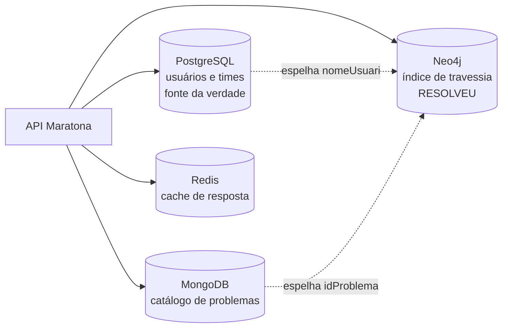

# Arquitetura

Escrevi isso porque toda vez que mostro o projeto aparece a mesma pergunta: por que quatro bancos num sistema de times e usuários?

A resposta honesta é que eu queria colocar em prática o que estudei de arquitetura, então desenhei uma solução sob medida em vez de jogar tudo no Postgres. Algumas dessas escolhas se pagam. Outras eu tomaria diferente hoje. Abaixo estão as duas categorias, sem separar em "boas práticas aplicadas".

Vale deixar claro de saída: isto é uma prova de conceito. Não foi feito para aguentar tráfego real, e várias decisões só fazem sentido com isso em mente.

## Por que quatro bancos

Num sistema onde usuários se relacionam entre si, consistência não é negociável. Daí o PostgreSQL com garantias ACID para tudo que envolve conta e time. Seria mais fácil colocar tudo num banco só, sim. Mas numa aplicação real, com milhares de requisições, você precisa separar o que é perigoso e tem que ser certeiro daquilo que é só consulta.

O MongoDB é o lado da leitura. A função dele é devolver os detalhes de cada problema dentro de uma lista imensa de exercícios.

O Neo4j existe pela recomendação, e é a escolha que eu mais defendo. Dava para fazer com vários joins, mas join custa tempo e o número de problemas armazenados só cresce. A consulta de similaridade é uma travessia de profundidade 4: eu, um problema que resolvi, outro usuário que resolveu o mesmo, e os problemas que esse outro resolveu. Em SQL isso são três self-joins que degradam com o volume. Em Cypher é uma linha. Fora que ali não preciso de consistência forte, porque recomendação errada não quebra nada.

O Redis é eficiência pura. Montar a lista completa de problemas a cada requisição é tempo jogado fora.

## O usuário existe em dois bancos ao mesmo tempo. Isso não sai caro?

Sai, e foi consciente. Eu precisava da eficiência de busca em grafo sem abrir mão do detalhe e da consistência que o ACID dá.

O arranjo é esse: o Postgres é a fonte da verdade, o Neo4j é um índice especializado em travessia. O `UsuarioNode` guarda só o `nomeUsuario` e as arestas `RESOLVEU`. Nada mais.

O preço é manter o espelho em dia. Trocar o `nomeUsuario` grava no Postgres e roda um `SET` no Neo4j. Excluir a conta apaga nos dois.

## E se o Postgres gravar e o Neo4j falhar?

Confesso que não parei pra pensar nisso quando desenhei. Mas o raciocínio se sustenta: o vital não está no Neo4j, está no Postgres.

O código convive com a divergência. Quando registro um problema resolvido, a escrita no Neo4j fica num try/catch que engole a exceção e segue em frente, pra sincronização não travar por causa de uma aresta. Se der errado, no pior caso uma recomendação fica pior. Nada essencial se perde.

Não foi decisão deliberada. Foi uma consequência que resistiu ao exame depois.

## Por que dois TransactionManager separados

Esse veio de um problema real: a conexão fechava e gerava um erro em cascata. Separar em dois, `@Primary` para o Postgres e um específico para o Neo4j, resolveu.

Fui aprendendo na dificuldade, e provavelmente não é a melhor solução. Ela também criou uma pegadinha: qualquer método que toque em repositório do Neo4j precisa escrever `@Transactional("neo4jTransactionManager")` explicitamente. Com `@Transactional` puro a transação abre no Postgres, em silêncio.

## Se o scraping é bloqueado, o que sobra da justificativa do Mongo?

Essa foi a dívida que mais me incomodou, e agora tem resposta.

Por muito tempo achei que fosse header ou timeout. Não era. O bloqueio acontece no handshake TLS: o fingerprint do cliente HTTP do Java entrega que não é navegador antes de qualquer cabeçalho ser lido. Medi contra o mesmo problema: o Jsoup com referer e 20 segundos de timeout dá 403, o curl com o jogo completo de headers de navegador também dá 403, e um cliente que imita o fingerprint do Chrome responde 200 em menos de um segundo. Nenhum ajuste no Java ia resolver isso.

Por isso o scraping saiu da aplicação. Quem busca o enunciado é o `scripts/backfill_enunciados.py`, e ele roda fora da API de propósito: enunciado de problema publicado não muda, então isso é backfill que roda uma vez, não trabalho de requisição. O `cadastrarProblema` grava o que a submissão já traz, nome, tags e rating, e deixa a descrição pro script preencher depois. Se o script quebrar um dia, a API continua no ar.

Com o enunciado entrando de verdade, a justificativa do Mongo volta a valer: HTML denso e sem esquema é exatamente o caso de uso de banco de documentos.

## A sincronização é disparada e esquecida

A parte assíncrona é de propósito. Não faz sentido segurar a resposta do cadastro enquanto o sistema processa centenas de problemas.

O que falta é o retry. A ideia é ficar tentando de novo sem o usuário saber, porque isso é questão de backend, não de interface. Ele não precisa acompanhar; o sistema é que precisa insistir até dar certo. Hoje a falha só vai pro log e morre ali.

## O nomeUsuario é login, chave em dois bancos e handle do Codeforces

O ponto mais frágil é que ninguém prova ser dono do handle. Dá pra se cadastrar com o nome de qualquer competidor e herdar o rating dele. Eu sei do problema. Verificar autoria de verdade exigiria outro mecanismo, e como o projeto é prova de conceito, achei melhor não colocar.

A edição do `nomeUsuario` entrou pelo mesmo motivo, pra demonstrar o fluxo. Curiosamente o próprio Codeforces só deixa trocar o handle no início de cada ano, justamente pelo peso que ele carrega. Aqui a troca é livre, e o custo aparece: precisa gravar no Postgres, atualizar o nó no Neo4j e emitir um token novo, porque o subject do JWT mudou.

## Por que a segurança liberava tudo por padrão

Liberava mesmo. O `SecurityConfig` terminava em `anyRequest().permitAll()` e as rotas protegidas eram listadas como exceção. Revisando, decidi que estava errado e inverti.

O problema não era a superfície protegida, que continua igual. Era o modo de falhar. Com allow by default, esquecer um matcher deixa a rota aberta em silêncio. E isso não era hipotético: aconteceu duas vezes, sempre por matcher sem `/**`, e nas duas a rota respondia 500 em vez de 401, porque o `Authentication` chegava nulo no controller.

Hoje as 13 rotas públicas estão listadas uma a uma e `anyRequest()` é `authenticated()`. Se eu esquecer de classificar uma rota nova, ela fecha. Chato, mas eu descubro na primeira chamada em vez de descobrir depois.

## Por que não existem papéis

Escopo reduzido. Não tem administrador, e o controle de acesso é feito dentro dos serviços comparando quem chama com o dono do recurso.

Sobre o time que fica travado quando o capitão abandona a conta: a saída que faz sentido pra mim não é criar um administrador, é expiração. Igual ao Yahoo, que apaga a conta depois de cinco anos sem uso.

O que me incomodava de verdade era a regra de autorização espalhada. A dupla "a conta existe?" mais "o token é dela?" estava copiada em seis métodos. Já centralizei. O risco da cópia nunca foi desperdício, era esquecimento: um serviço novo sem a segunda metade deixaria qualquer autenticado mexer em conta alheia.

## Se o token já prova quem é, por que pedir a senha de novo

Porque são coisas diferentes. O token diz quem você é. A senha diz que você está aí agora.

É uma camada a mais pra confirmar que a pessoa é mesmo quem diz ser no momento da ação. Alterar e-mail, senha, `nomeUsuario` ou excluir a conta pedem a senha atual mesmo com token válido. Alterar o nome de exibição não pede, porque não é credencial e o atrito não se justifica.

## O cache limpa demais

Limpa. A regra que usei foi "na dúvida, limpa tudo", pra ter certeza de não servir dado velho. Não é o ideal, eu quis poupar complexidade.

São três caches nomeados pelo que devolvem, com TTL de 60 minutos. A consequência mais visível dessa escolha só apareceu quando fui medir: durante a sincronização com o Codeforces, o `cadastrarProblema` invalida o `cacheTodosProblemas` inteiro a cada problema processado. São cerca de 140 vezes seguidas numa carga inicial. Enquanto a sync roda, esse cache não serve pra nada.

E, como em qualquer coisa que roda, sem dúvida tem mais coisa que eu ainda não vi.
